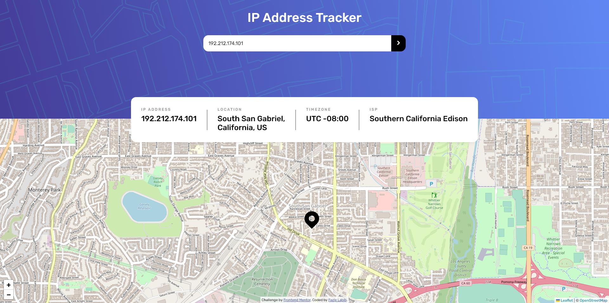
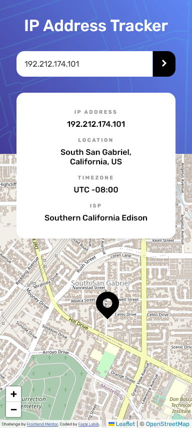

# Frontend Mentor - IP address tracker solution

This is a solution to the [IP address tracker challenge on Frontend Mentor](https://www.frontendmentor.io/challenges/ip-address-tracker-I8-0yYAH0). Frontend Mentor challenges help you improve your coding skills by building realistic projects. 

## Table of contents

- [Overview](#overview)
  - [The challenge](#the-challenge)
  - [Screenshot](#screenshot)
  - [Links](#links)
- [My process](#my-process)
  - [Built with](#built-with)
  - [What I learned](#what-i-learned)
  - [Continued development](#continued-development)
  - [Useful resources](#useful-resources)
- [Author](#author)

## Overview

### The challenge

Users should be able to:

- View the optimal layout for each page depending on their device's screen size
- See hover states for all interactive elements on the page
- See their own IP address on the map on the initial page load
- Search for any IP addresses or domains and see the key information and location

### Screenshot




### Links

- Solution URL: [Solution](https://github.com/FazleLabib/frontend-mentor-ip-address-tracker)
- Live Site URL: [Live Site](https://frontend-mentor-ip-address-tracker-eta.vercel.app)

## My process

### Built with

- Semantic HTML5 markup
- CSS custom properties
- Flexbox
- CSS Grid
- Vanilla JavaScript
- Leaflet Library

### What I learned

Learned how to hide API keys and deploy site on vercel. Additionally, learned how to integrate Leaflet library.

<!-- ```html
<h1>Some HTML code I'm proud of</h1>
```
```css
.proud-of-this-css {
  color: papayawhip;
}
```
```js
const proudOfThisFunc = () => {
  console.log('🎉')
}
``` -->

### Continued development

The current design is not suitable for mobile screens. I plan to remake this site with a more accessible design in future.

### Useful resources

- [Hiding API Keys in Javascript Netlify](https://www.youtube.com/watch?v=2J3xbMkH2K4) - This helped with hiding the API key from github. I modified it to make it work for vercel. **Note: API key can still be seen using developer tools.**
- [ipgeolocation API](https://ipgeolocation.io) - I'm using this API to fetch the data as this provides better free options than ipify.

## Author

- Frontend Mentor - [@FazleLabib](https://www.frontendmentor.io/profile/FazleLabib)